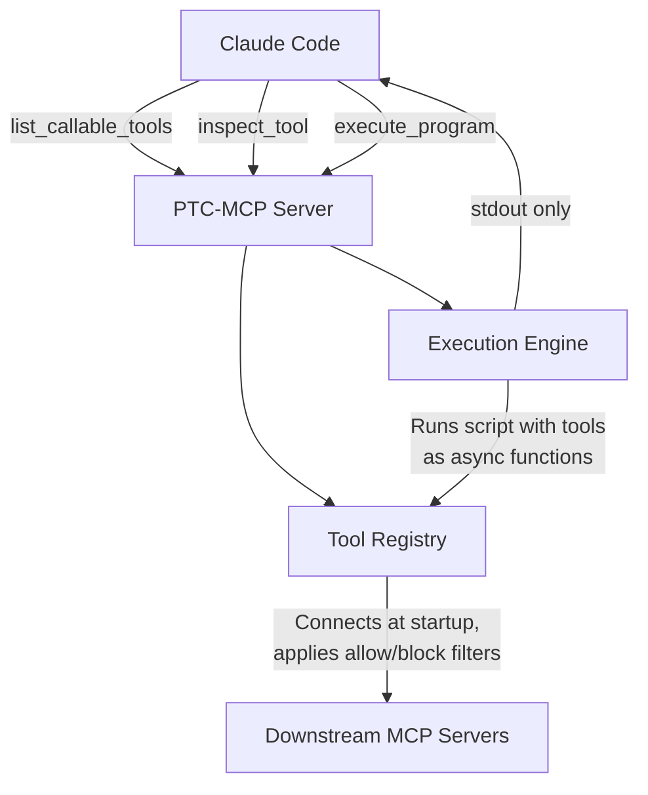

# Programmatic Tool Call MCP

Programmatic Tool Calling for Claude Code via MCP.

Claude Code on subscription plans lacks the Anthropic API's programmatic tool calling (PTC) feature, where Claude can write Python scripts that call multiple tools in a single execution. Without it, every tool invocation is a full model round-trip — intermediate results enter the context window, consuming tokens and adding latency.

PTC-MCP fixes this. It's an MCP server that exposes three tools:

- **`list_callable_tools`** — Returns a JSON list of all available tool names. Use this to discover what's callable before writing a script.
- **`inspect_tool`** — Returns the schema and description of a specific tool, including its `outputSchema` if the upstream server defines one.
- **`execute_program`** — Runs a Python script with MCP tools injected as async functions. Only stdout comes back. Intermediate tool results stay in the Python runtime and never enter the conversation.

## How it works



At startup, PTC-MCP connects to your configured MCP servers as a client, discovers their tools, and makes them callable as `mcp__<server>__<tool>()` async functions inside scripts. Claude can call `list_callable_tools` to discover available tools, `inspect_tool` to understand a tool's schema, and then `execute_program` to run a script using those tools. Tool calls proxy to the real MCP servers, results stay local, and only `print()` output goes back.

## Tools

### `list_callable_tools`

Takes no arguments. Returns a JSON array of sorted namespaced tool names:

```json
["mcp__financial_data__query_financials", "mcp__internal_apis__get_resource"]
```

### `inspect_tool`

Takes a `tool_name` string. Returns the tool's schema, description, and `outputSchema` (if available):

```json
{
  "name": "mcp__financial_data__query_financials",
  "description": "Query financial statements for a given ticker.",
  "inputSchema": { "type": "object", "properties": { "ticker": { "type": "string" } }, "required": ["ticker"] },
  "outputSchema": null,
  "note": "No output schema defined by the upstream server. Inspect the return value in your script."
}
```

> **Note:** `outputSchema` is populated when the downstream MCP server defines one on its tools per the [MCP tool output schema specification](https://modelcontextprotocol.io/specification/draft/server/tools#output-schema). Downstream servers that declare output schemas improve discoverability — Claude can understand return types before writing a script. Without one, `inspect_tool` returns `null` for `outputSchema` and suggests inspecting return values at runtime instead.

### `execute_program`

Takes a `code` string. Runs the Python script with all registered tools available as async functions. Returns stdout prefixed with a status line.

## Example

Claude decides comparing three tickers benefits from batched execution:

```python
execute_program(code="""
tickers = ["AMZN", "MSFT", "GOOG"]
for t in tickers:
    data = await mcp__financial_data__query_financials(
        ticker=t, statement="income", period="quarter", limit=4
    )
    revenues = [q["revenue"] for q in data]
    trend = " → ".join(f"${r/1e9:.1f}B" for r in revenues)
    print(f"{t}: {trend}")
""")
```

Three tool calls happen inside the script. Claude sees only:

```
[Script executed successfully]
AMZN: $170.0B → $165.3B → $158.9B → $149.2B
MSFT: $65.6B → $62.0B → $59.1B → $56.5B
GOOG: $96.5B → $88.3B → $85.0B → $80.5B
```

## Setup

Requires Python 3.11+.

```bash
uv venv && uv pip install -e ".[dev]"
```

## Configuration

Create a `config.yaml` (or set `PTC_MCP_CONFIG` to point elsewhere):

```yaml
servers:
  - name: financial-data
    transport: stdio
    command: node
    args: ["./financial-data-mcp/dist/index.js"]

  - name: internal-apis
    transport: sse
    url: "http://localhost:8080/mcp"

tools:
  block:
    - "mcp__internal_apis__delete_resource"

execution:
  timeout_seconds: 120
  max_output_bytes: 65536
```

- **servers** — MCP servers to bridge. Supports `stdio` and `sse` transports.
- **tools.allow / tools.block** — Whitelist or blacklist namespaced tool names (mutually exclusive). Omit both to allow everything.
- **execution** — Timeout and output size limits for `execute_program`.

The server starts fine with no config file or an empty `servers` list.

## Running

```bash
# Directly
uv run python -m ptc_mcp

# Or via the installed entry point
ptc-mcp
```

The server communicates over stdio (JSON-RPC). Add it to your Claude Code MCP settings to use it.

## Testing

```bash
uv run pytest tests/ -v
```

Tests include unit tests for config parsing, the execution engine, registry filtering/namespacing, and end-to-end integration tests that spin up a real mock MCP server.
