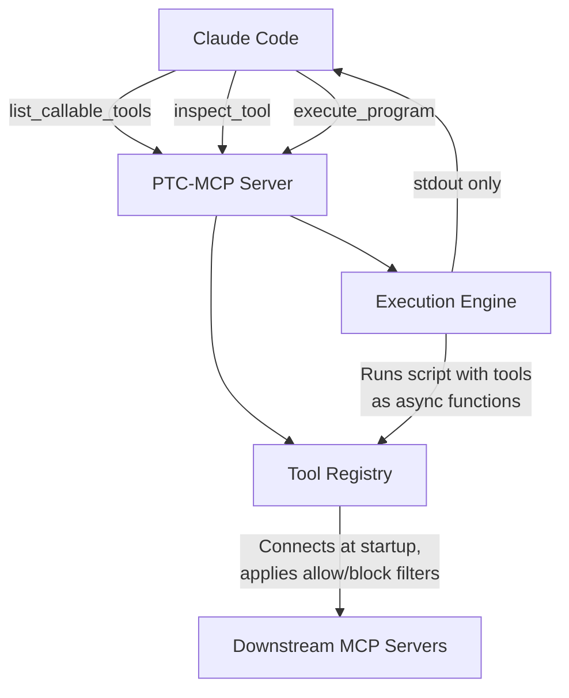

# Programmatic Tool Call MCP

Programmatic Tool Calling for Claude Code via MCP.

Claude Code on subscription plans lacks the Anthropic API's programmatic tool calling (PTC) feature, where Claude can write Python scripts that call multiple tools in a single execution. Without it, every tool invocation is a full model round-trip — intermediate results enter the context window, consuming tokens and adding latency.

PTC-MCP fixes this. It's an MCP server that exposes three tools:

- **`list_callable_tools`** — Returns a JSON list of all available tool names. Use this to discover what's callable before writing a script.
- **`inspect_tool`** — Returns the schema and description of a specific tool, including its `outputSchema` if the upstream server defines one.
- **`execute_program`** — Runs a Python script with MCP tools injected as async functions. Only stdout comes back. Intermediate tool results stay in the Python runtime and never enter the conversation.

## How it works


```mermaid
flowchart TD
    A[Claude Code] -->|list_callable_tools| B[PTC-MCP Server]
    A -->|inspect_tool| B
    A -->|execute_program| B

    B --> C[Tool Registry]
    B --> D[Execution Engine]

    C -->|Connects at startup,<br/>applies allow/block filters| E[Downstream MCP Servers]
    D -->|Runs script with tools<br/>as async functions| C
    D -->|stdout only| A
```

At startup, PTC-MCP connects to your configured MCP servers as a client, discovers their tools, and makes them callable as `mcp__<server>__<tool>()` async functions inside scripts. Claude can call `list_callable_tools` to discover available tools, `inspect_tool` to understand a tool's schema, and then `execute_program` to run a script using those tools. Tool calls proxy to the real MCP servers, results stay local, and only `print()` output goes back.

## Tools

### `list_callable_tools`

Takes no arguments. Returns a JSON array of sorted namespaced tool names:

```json
["mcp__financial_data__query_financials", "mcp__internal_apis__get_resource"]
```

### `inspect_tool`

Takes a `tool_name` string. Returns the tool's schema, description, and `outputSchema` (if available):

```json
{
  "name": "mcp__financial_data__query_financials",
  "description": "Query financial statements for a given ticker.",
  "inputSchema": { "type": "object", "properties": { "ticker": { "type": "string" } }, "required": ["ticker"] },
  "outputSchema": null,
  "note": "No output schema defined by the upstream server. Inspect the return value in your script."
}
```

> **Note:** `outputSchema` is populated when the downstream MCP server defines one on its tools per the [MCP tool output schema specification](https://modelcontextprotocol.io/specification/draft/server/tools#output-schema). Downstream servers that declare output schemas improve discoverability — Claude can understand return types before writing a script. Without one, `inspect_tool` returns `null` for `outputSchema` and suggests inspecting return values at runtime instead.

### `execute_program`

Takes a `code` string. Runs the Python script in a sandboxed child process with all registered tools available as async functions. Returns stdout prefixed with a status line (plus any `emit()` result and a tool-call summary), and structured content with `ok`, `output`, `result`, `error`, and `tool_calls`. Failed runs set MCP `isError`.

## Example

Claude decides comparing three tickers benefits from batched execution:

```python
execute_program(code="""
tickers = ["AMZN", "MSFT", "GOOG"]
for t in tickers:
    data = await mcp__financial_data__query_financials(
        ticker=t, statement="income", period="quarter", limit=4
    )
    revenues = [q["revenue"] for q in data]
    trend = " → ".join(f"${r/1e9:.1f}B" for r in revenues)
    print(f"{t}: {trend}")
""")
```

Three tool calls happen inside the script. Claude sees only:

```
[Script executed successfully]
AMZN: $170.0B → $165.3B → $158.9B → $149.2B
MSFT: $65.6B → $62.0B → $59.1B → $56.5B
GOOG: $96.5B → $88.3B → $85.0B → $80.5B
```

## Setup

Requires Python 3.11+.

```bash
uv venv && uv pip install -e ".[dev]"
```

## Configuration

Copy `config.example.yaml` to `config.yaml` (gitignored) and edit it, or set `PTC_MCP_CONFIG` to point elsewhere. Keep secrets out of the file with `${VAR}` references:

```yaml
servers:
  - name: financial-data
    transport: stdio
    command: node
    args: ["./financial-data-mcp/dist/index.js"]
    env:
      API_KEY: ${FINANCIAL_DATA_API_KEY}     # from ptc-mcp's environment

  - name: internal-apis
    transport: http                          # streamable HTTP ("sse" also supported)
    url: "https://internal.example.com/mcp"
    headers:
      Authorization: "Bearer ${INTERNAL_TOKEN}"

tools:
  allow:                                     # glob patterns; or use `block`
    - "mcp__financial_data__*"

execution:
  timeout_seconds: 120
  max_output_bytes: 65536
  sandbox: seatbelt            # or "none"
  max_tool_calls: 100          # per program (introspection helpers not counted)
  max_concurrent_calls: 8
  tool_call_timeout_seconds: 60
  trace: summary               # or "off"
  max_tool_result_bytes: 16777216  # per tool result passed into a script
```

- **servers** — MCP servers to bridge: `stdio`, `http` (streamable HTTP), or `sse`.
  `command`, `args`, `env`, `url`, and `headers` expand `${VAR}` and
  `${VAR:-default}`; an unset variable without a default is a config error.
- **tools.allow / tools.block** — namespaced tool names or glob patterns
  (mutually exclusive). Omit both to allow everything; prefer an allowlist.
- **execution** — time/output limits, the sandbox mode (below), and the
  per-program tool-call budget.

## Results, errors, and budgets

Inside a program:

- Tool results are parsed JSON. When the server returns structured content it
  is used directly; any extra text the server sent (e.g. "EMPTY RESULT …"
  warnings) is kept under a `_notes` key instead of being lost or turning the
  result into a string.
- A tool that fails raises `ToolError`; catch it to continue. That covers an
  `is_error` result, a protocol error, a timeout, an exhausted budget, a result
  that does not match the tool's declared output schema, a result larger than
  `max_tool_result_bytes`, and a lost connection. Only a lost connection
  triggers a reconnect; bad data from a healthy server never does.
- Non-text content (images, audio, embedded resources) cannot enter the
  sandbox; it is replaced by a `_notes` placeholder such as
  `[non-text content omitted: image (image/png)]` rather than dropped silently.
- `emit(value)` returns a JSON-serializable structured result (last call wins).
  It appears after `--- result ---` in the output and as `result` in the
  `execute_program` structured content.
- Helpers: `list_callable_tools()`, `inspect_tool(tool_name=...)`, and
  `server_status()` (connection state of each downstream server).

Each program may make at most `max_tool_calls` calls, `max_concurrent_calls`
at a time, each bounded by `tool_call_timeout_seconds`. With `trace: summary`
the output ends with a line such as `[tool calls: 12, 1 failed; 2.3s]` plus the
failures; the structured content always lists every call (tool, arguments, ok,
duration, error).

Known limitation: FastMCP-style servers wrap non-object returns as
`{"result": value}` and ptc unwraps that shape. A server that genuinely returns
an object whose only key is `result`, alongside prose text that is not its JSON
rendering, is indistinguishable and will be unwrapped too.

Each downstream server is supervised: if it fails to start or its connection
drops, ptc-mcp keeps reconnecting with backoff. Its tools disappear from
`list_callable_tools` (which then names the unavailable servers) and reappear
once it is back.

## Sandbox

Scripts never run inside the server process. Each `execute_program` call starts a
fresh child interpreter and talks to it over stdin/stdout; only the server holds
the MCP sessions, so **tools are the only way a script can reach data**.

- **`sandbox: seatbelt`** (default, macOS): the child runs under `sandbox-exec`
  with a deny-by-default profile — no network, no subprocesses or `fork`, no
  reads or writes outside a per-run scratch directory (its working directory,
  deleted afterwards), and no way to even check whether files exist elsewhere.
- **`sandbox: none`**: same child process, empty environment, and limits, but
  without the OS sandbox. Explicit opt-in (e.g. Linux CI). If `seatbelt` is
  configured but unavailable, scripts refuse to run rather than fall back.

In every mode the child:

- gets an **empty environment** (API keys in the server's environment or in a
  server's `env` config are never visible to scripts),
- runs the base interpreter with `-I -S`: **standard library only** — the
  server's own packages are not importable,
- is **killed at `timeout_seconds`**, including CPU-bound code (`while True:`),
  with CPU-time, file-size and open-file limits as a backstop,
- cannot corrupt the tool channel: `print`, `os.write(1, ...)`, and leftover
  background tasks all stay inside the child.

`sandbox-exec` is deprecated by Apple but still ships and enforces (Claude Code
and Codex CLI use it the same way). It is isolated in `sandbox.py`, so another
backend (Docker, Apple `container`) can replace it.

Failed runs — script errors, timeouts, sandbox failures — are returned with MCP
`isError: true`.

The server starts fine with no config file or an empty `servers` list.

## Running

```bash
# Directly
uv run python -m ptc_mcp

# Or via the installed entry point
ptc-mcp
```

The server communicates over stdio (JSON-RPC). Add it to your Claude Code MCP settings to use it.

## Testing

```bash
uv run pytest tests/ -v
```

Tests include unit tests for config parsing, the execution engine, registry filtering/namespacing, sandbox isolation (escape attempts, timeouts, channel integrity), result parsing, budgets, and end-to-end integration tests that spin up a real mock MCP server (including crash-and-reconnect). Built on MCP Python SDK 2.x; serves both 2025-era clients (e.g. Claude Code) and 2026-07-28 clients.
