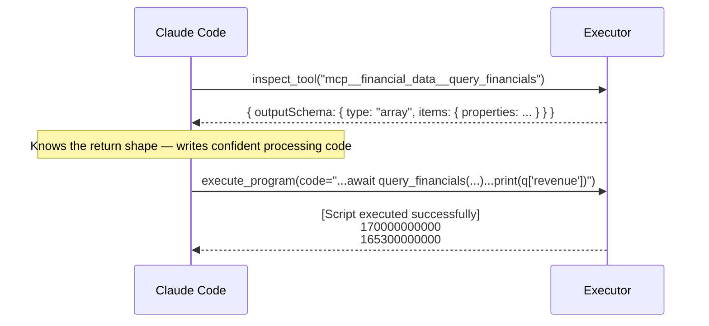
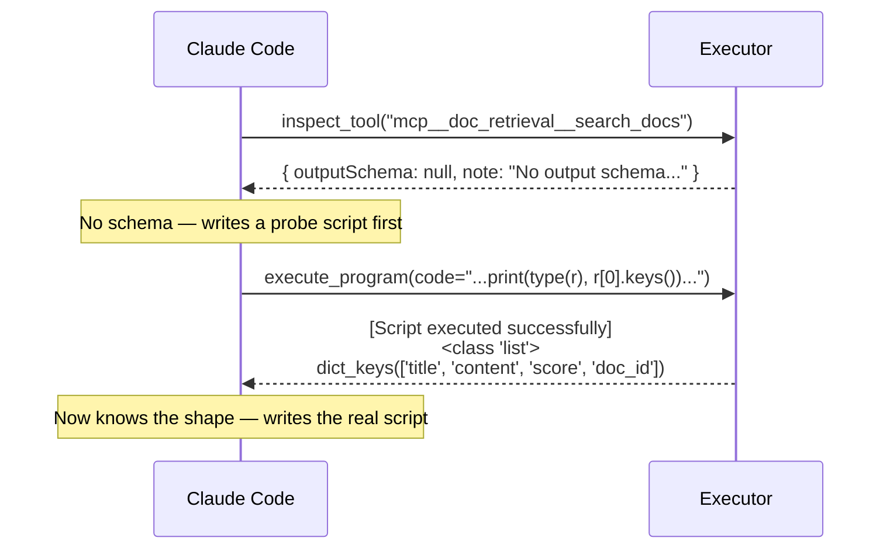

# Enhancement Spec: Tool Output Schema Inspection
## Summary

Add an `inspect_tool` tool to the programmatic executor MCP server that returns a tool's input schema, description, and output schema (if defined by the upstream MCP server). This enables Claude Code to understand tool return shapes before writing processing code for `execute_program`.

## Motivation

The original design exposes a single tool (`execute_program`) and relies on Claude Code's existing knowledge of tool schemas to write correct scripts. However, MCP tool definitions only standardize `inputSchema` — there is no standard `outputSchema` field. This means Claude Code has no reliable way to know what a tool returns, leading to:

- Incorrect field access in processing code (e.g., `data["revenue"]` when the key is `"totalRevenue"`)
- Wasted `execute_program` calls that fail on `KeyError` / `TypeError`
- Defensive probe calls (`print(type(result))`) that cost an extra round-trip every time

Upstream MCP servers are the authoritative source for their tool contracts. If they define output schemas, the executor should surface them. If they don't, the executor should say so explicitly rather than let Claude Code guess.

## Design

### Registry Change

`RegisteredTool` gains an `output_schema` field:

```python
@dataclass
class RegisteredTool:
    name: str
    description: str
    parameters: dict           # inputSchema
    output_schema: dict | None # outputSchema (from upstream, if defined)
    handler: Callable
```

At startup, when the executor calls `list_tools()` on each upstream server, it captures the `outputSchema` field if present on the tool definition. This is a non-standard MCP field — upstream servers that don't define it simply result in `output_schema = None`.

```python
for tool in tools:
    namespaced = f"mcp__{server_config.name}__{tool.name}"
    self.registry[namespaced] = RegisteredTool(
        name=namespaced,
        description=tool.description,
        parameters=tool.inputSchema,
        output_schema=getattr(tool, "outputSchema", None),
        handler=self._make_bridge_handler(client, tool.name, namespaced)
    )
```

### New Tool: `inspect_tool`

```json
{
  "name": "inspect_tool",
  "description": "Returns the schema and description of a tool available in execute_program. Includes outputSchema if the upstream MCP server defines one. Call this before writing a script if you need to understand a tool's return format.",
  "inputSchema": {
    "type": "object",
    "properties": {
      "tool_name": {
        "type": "string",
        "description": "Namespaced tool name (e.g., mcp__financial_data__query_financials)"
      }
    },
    "required": ["tool_name"]
  }
}
```

### Response Format

**Tool found, output schema defined:**

```json
{
  "name": "mcp__financial_data__query_financials",
  "description": "Fetch income/balance/cashflow statements for a ticker.",
  "inputSchema": {
    "type": "object",
    "properties": {
      "ticker": { "type": "string" },
      "statement": { "type": "string", "enum": ["income", "balance", "cashflow"] },
      "period": { "type": "string", "enum": ["annual", "quarter"] },
      "limit": { "type": "integer" }
    },
    "required": ["ticker", "statement"]
  },
  "outputSchema": {
    "type": "array",
    "items": {
      "type": "object",
      "properties": {
        "revenue": { "type": "number" },
        "netIncome": { "type": "number" },
        "operatingIncome": { "type": "number" },
        "period": { "type": "string" },
        "date": { "type": "string", "format": "date" }
      }
    }
  }
}
```

**Tool found, no output schema defined:**

```json
{
  "name": "mcp__doc_retrieval__search_docs",
  "description": "Search internal documents by query string.",
  "inputSchema": {
    "type": "object",
    "properties": {
      "query": { "type": "string" },
      "limit": { "type": "integer" }
    },
    "required": ["query"]
  },
  "outputSchema": null,
  "note": "No output schema defined by the upstream server. Inspect the return value in your script (e.g., print(type(result), result[:1])) to determine the structure."
}
```

**Tool not found:**

```
[Tool not found] 'mcp__nonexistent__foo' is not available in execute_program
```

### Implementation

```python
@server.tool()
async def inspect_tool(tool_name: str) -> str:
    tool = self.registry.get(tool_name)
    if not tool:
        return f"[Tool not found] '{tool_name}' is not available in execute_program"

    result = {
        "name": tool.name,
        "description": tool.description,
        "inputSchema": tool.parameters,
    }

    if tool.output_schema:
        result["outputSchema"] = tool.output_schema
    else:
        result["outputSchema"] = None
        result["note"] = (
            "No output schema defined by the upstream server. "
            "Inspect the return value in your script "
            "(e.g., print(type(result), result[:1])) to determine the structure."
        )

    return json.dumps(result, indent=2)
```

## Interaction Pattern

### With output schema available



### Without output schema



## Upstream MCP Server Convention

For upstream MCP servers to participate, they add an `outputSchema` field to their tool definitions. This is a non-standard extension — MCP does not currently include `outputSchema` in the tool spec. The field follows the same JSON Schema format as `inputSchema`:

```python
# In an upstream MCP server's tool definition
@server.tool(
    name="query_financials",
    description="Fetch financial statements for a ticker.",
    inputSchema={ ... },
    outputSchema={  # non-standard, captured by executor if present
        "type": "array",
        "items": {
            "type": "object",
            "properties": {
                "revenue": { "type": "number" },
                "netIncome": { "type": "number" }
            }
        }
    }
)
```

The executor does not require upstream servers to define this field. It is purely additive — servers that define it get better script generation; servers that don't still work, with the tradeoff of a possible probe call.

## Changes to Original Design

| Component | Original | With This Enhancement |
|---|---|---|
| MCP tools exposed | `execute_program` only | `execute_program` + `inspect_tool` |
| `RegisteredTool` fields | name, description, parameters, handler | + `output_schema` |
| Startup behavior | Captures name, description, inputSchema | Also captures `outputSchema` if present |
| Upstream MCP server requirements | No changes needed | Optionally define `outputSchema` for richer inspection |

## Non-Goals

- **The executor does not validate tool output against the schema.** `outputSchema` is purely informational — it helps Claude Code write correct code, but the executor does not enforce conformance at runtime.
- **The executor does not infer schemas from observed responses.** Schema inference introduces inconsistency (different inputs may produce different shapes). The upstream server defines the contract or it doesn't.
- **This does not propose changes to the MCP specification.** `outputSchema` is a convention between the executor and upstream servers. Formal MCP spec changes are out of scope.
