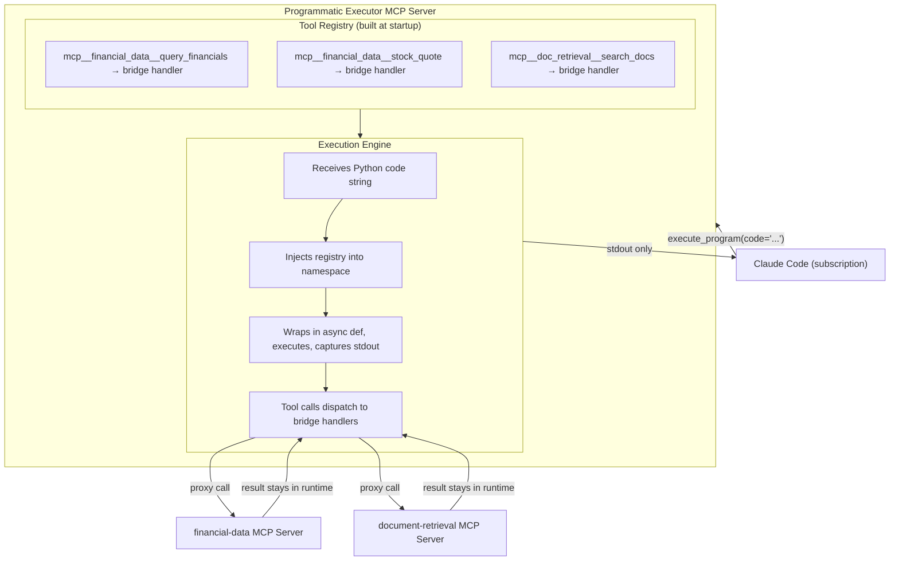

# Programmatic Tool Calling MCP Server
## 1. Problem Statement

Claude Code operates on subscription plans and does not have access to the Anthropic API's programmatic tool calling (PTC) feature. PTC enables Claude to write Python programs that call multiple tools within a single execution, returning only the final output to the model's context window. Without PTC, every tool invocation in Claude Code requires a full round-trip through the model — each intermediate result enters the context window, consuming tokens and adding latency.

For multi-tool workflows common in finance operations (e.g., comparing financial data across 10 tickers, aggregating document retrieval results, conditional data processing), this means:

- **N tool calls = N round-trips**, each requiring Claude to re-read the full conversation
- **Intermediate results bloat context**, even when only a summary is needed
- **No programmatic control flow** — loops, conditionals, and early termination all require the model to reason through each step individually

## 2. Objective

Build an MCP server that provides PTC-equivalent functionality to Claude Code without relying on the Anthropic API. The server exposes a single tool (`execute_program`) that accepts a Python script, executes it with registered tool functions injected into the namespace, and returns only the script's stdout to Claude Code.

### Design Principles

- **No API dependency** — runs entirely within Claude Code's subscription context
- **Token efficiency** — intermediate tool results never enter Claude's context window
- **Composability** — bridges existing MCP servers; no need to reimplement tools
- **Simplicity** — single tool interface, minimal configuration, stateless execution

## 3. Architecture



**Key points:**
- Claude Code already discovers tools from all connected MCP servers and knows their names, schemas, and descriptions.
- It decides when a task benefits from batched execution and writes a Python script using namespaced tool names.
- Only stdout with a status prefix is returned to Claude Code's context. Intermediate tool results never leave the Python runtime.

## 4. Configuration

The server is configured similarly to any MCP client — a list of MCP servers to connect to, plus tool-level access control.

```yaml
# programmatic-executor/config.yaml

servers:
  - name: financial-data
    transport: stdio
    command: node
    args: ["./financial-data-mcp/dist/index.js"]

  - name: document-retrieval
    transport: stdio
    command: python
    args: ["-m", "doc_retrieval_mcp"]

  - name: internal-apis
    transport: sse
    url: "http://localhost:8080/mcp"

# Tool-level access control (uses namespaced names)
tools:
  block:
    - "mcp__internal_apis__delete_resource"
    - "mcp__document_retrieval__admin_reindex"

# Execution constraints
execution:
  timeout_seconds: 120
  max_output_bytes: 65536
```

### Configuration Semantics

- **`servers`** — MCP servers the executor connects to as a client. Each entry specifies transport (stdio or SSE) and connection details.
- **`tools.block`** — tools that cannot be called from within `execute_program`. Calls to blocked tools raise a `ToolError` with a descriptive message. If omitted, all discovered tools are allowed.
- **`tools.allow`** — if specified, only listed tools are permitted. `allow` and `block` are mutually exclusive.
- **`execution.timeout_seconds`** — maximum wall-clock time for a single `execute_program` invocation.
- **`execution.max_output_bytes`** — stdout is truncated beyond this limit.

## 5. Tool Registry

### 5.1 Startup Sequence

At startup, the server:

1. Connects to each configured MCP server as a client
2. Calls `list_tools()` on each connection
3. Applies allow/block filtering
4. Registers surviving tools with namespaced names matching Claude Code's convention

```python
async def initialize(self):
    for server_config in self.config.servers:
        client = await self._connect_mcp(server_config)
        self.mcp_clients[server_config.name] = client

        tools = await client.list_tools()
        for tool in tools:
            namespaced = f"mcp__{server_config.name}__{tool.name}"

            if self._is_blocked(namespaced):
                continue

            self.registry[namespaced] = RegisteredTool(
                name=namespaced,
                description=tool.description,
                parameters=tool.inputSchema,
                handler=self._make_bridge_handler(client, tool.name, namespaced)
            )
```

### 5.2 Namespacing

Tools are registered using Claude Code's namespacing convention: `mcp__<server_name>__<tool_name>`. This ensures that when Claude Code writes a script, the function names it uses match what's in the executor's namespace.

Name collisions between servers are resolved by construction — the server name prefix guarantees uniqueness. If two servers expose `query_data`, they appear as `mcp__server_a__query_data` and `mcp__server_b__query_data`.

### 5.3 Bridge Handlers

Each registered tool gets a handler that proxies calls to the originating MCP server:

```python
def _make_bridge_handler(self, client: ClientSession, tool_name: str, namespaced: str):
    async def handler(**kwargs):
        try:
            result = await client.call_tool(tool_name, kwargs)
            return self._parse_mcp_result(result)
        except Exception as e:
            raise ToolError(f"'{namespaced}' failed: {e}")
    return handler
```

The handler:

- Forwards keyword arguments to the real MCP server via `call_tool`
- Parses the MCP result into a Python-native type (dict, list, string)
- Wraps errors in `ToolError` for clean traceback reporting

### 5.4 Blocked Tool Handling

If Claude writes a script that calls a blocked tool, the execution fails with a clear error:

```
[Script execution failed]
ToolError: 'mcp__internal_apis__delete_resource' is not available in execute_program
```

This is enforced at the access control layer before the handler is ever registered. Since blocked tools are excluded from the registry entirely, the Python runtime raises a `NameError`, which is caught and returned. Alternatively, a sentinel handler can be registered that raises `ToolError` with the descriptive message — this produces a cleaner error than a raw `NameError`.

## 6. Execution Engine

### 6.1 MCP Interface

The server exposes a single tool to Claude Code:

```json
{
  "name": "execute_program",
  "description": "Execute a Python program with access to MCP tools as async functions. Tool calls within the script are dispatched to their respective MCP servers. Only stdout (from print statements) is returned — intermediate tool results do not enter the conversation context. Use this when a task involves 3+ tool calls, loops, filtering, aggregation, or conditional logic based on intermediate results. For single tool calls, call the tool directly. All tool functions require `await`.",
  "inputSchema": {
    "type": "object",
    "properties": {
      "code": {
        "type": "string",
        "description": "Python code to execute. MCP tools are available as async functions using their namespaced names (e.g., mcp__financial_data__query_financials). Use `await` for all tool calls. Use `print()` to produce output."
      }
    },
    "required": ["code"]
  }
}
```

### 6.2 Execution Flow

```python
async def execute_program(self, code: str) -> str:
    # 1. Build namespace with all registered tool handlers
    namespace = {tool.name: tool.handler for tool in self.registry.values()}

    # 2. Wrap user code in an async function (enables top-level await)
    wrapped = "async def __main__():\n" + textwrap.indent(code, "    ")

    # 3. Compile and execute
    exec(compile(wrapped, "<program>", "exec"), namespace)

    # 4. Run with stdout capture and timeout
    stdout_buffer = io.StringIO()
    try:
        with contextlib.redirect_stdout(stdout_buffer):
            await asyncio.wait_for(
                namespace["__main__"](),
                timeout=self.config.execution.timeout_seconds
            )
    except asyncio.TimeoutError:
        return (
            f"[Script execution failed]\n"
            f"TimeoutError: Execution exceeded {self.config.execution.timeout_seconds}s limit"
        )
    except Exception:
        return f"[Script execution failed]\n{traceback.format_exc()}"

    # 5. Format output
    stdout = stdout_buffer.getvalue()
    if len(stdout.encode()) > self.config.execution.max_output_bytes:
        stdout = stdout[:self.config.execution.max_output_bytes] + "\n... (truncated)"

    if stdout.strip():
        return f"[Script executed successfully]\n{stdout}"
    else:
        return "[Script executed successfully]\n(no output)"
```

### 6.3 Output Format

The executor prefixes all output with a status indicator:

| Scenario | Output |
|---|---|
| Success with output | `[Script executed successfully]\n<stdout>` |
| Success, no print statements | `[Script executed successfully]\n(no output)` |
| Runtime error | `[Script execution failed]\n<traceback>` |
| Timeout | `[Script execution failed]\nTimeoutError: Execution exceeded 120s limit` |
| Output truncated | `[Script executed successfully]\n<partial stdout>\n... (truncated)` |

The `(no output)` case is explicit so Claude Code can distinguish between "the script ran and produced nothing" and a silent failure.

### 6.4 Statelessness

Each `execute_program` invocation runs in a fresh namespace. Variables, imports, and state from previous calls are not preserved. This keeps the execution model simple and predictable.

> **Future consideration:** Stateful execution (persisting the namespace across calls within a session) could be added later if agent workflows benefit from incremental computation. This would require session management and namespace lifecycle tracking.

## 7. Example Interaction

### User Request

> "Compare revenue trends for AMZN, MSFT, and GOOG over the last 4 quarters."

### Claude Code Behavior

Claude Code recognizes this requires 3 tool calls with post-processing and opts for `execute_program`:

```python
execute_program(code="""
tickers = ["AMZN", "MSFT", "GOOG"]
for t in tickers:
    data = await mcp__financial_data__query_financials(
        ticker=t, statement="income", period="quarter", limit=4
    )
    revenues = [q["revenue"] for q in data]
    trend = " → ".join(f"${r/1e9:.1f}B" for r in revenues)
    print(f"{t}: {trend}")
""")
```

### Execution

1. The executor injects `mcp__financial_data__query_financials` into the namespace
2. The loop executes 3 tool calls, each proxied to the `financial-data` MCP server
3. The raw financial data (potentially large JSON payloads) stays in the Python runtime
4. Only the printed summary returns to Claude Code

### Output to Claude Code

```
[Script executed successfully]
AMZN: $170.0B → $165.3B → $158.9B → $149.2B
MSFT: $65.6B → $62.0B → $59.1B → $56.5B
GOOG: $96.5B → $88.3B → $85.0B → $80.5B
```

Claude Code never sees the raw quarterly data — only the 3-line summary enters its context window.

## 8. Error Handling

### 8.1 Tool Call Failures

Tool errors inside the script propagate as Python exceptions. The `ToolError` wrapper provides clean messages:

```
[Script execution failed]
Traceback (most recent call last):
  File "<program>", line 3, in __main__
    data = await mcp__financial_data__query_financials(ticker=t, ...)
ToolError: 'mcp__financial_data__query_financials' failed: connection refused
```

Claude Code sees this and can diagnose the issue (server down, bad parameters, etc.).

### 8.2 Script Errors

Standard Python errors (KeyError, TypeError, etc.) from the agent's processing logic are returned as tracebacks. Claude Code can iterate on the script.

### 8.3 Timeouts

If the combined execution exceeds `timeout_seconds`, `asyncio.TimeoutError` is caught and reported. This prevents a hung tool call from blocking Claude Code indefinitely.

### 8.4 MCP Connection Failures

If an MCP server disconnects mid-execution, the bridge handler raises `ToolError`. If a server is unreachable at startup, the executor logs a warning and excludes that server's tools from the registry.

## 9. Security Considerations

`execute_program` runs LLM-generated Python code in the MCP server's process via `exec()`. This carries inherent risk.

### Current Scope (No Sandbox)

For the initial implementation, execution runs in-process without sandboxing. This is acceptable for personal/team use where:

- Claude Code is already trusted to run arbitrary bash commands
- The MCP server runs locally with the user's permissions
- The executor is not exposed to untrusted users

### Mitigations

- **Timeout enforcement** prevents runaway execution
- **Output size limits** prevent memory exhaustion
- **Tool allow/block lists** restrict what the script can interact with
- **No network access from scripts** — tools are the only interface to external systems (the script itself doesn't import `requests` or `urllib` unless explicitly enabled)

### Future: Sandboxed Execution

If the executor is deployed in a shared or production context, sandboxing becomes necessary. The execution engine is designed to be swappable — the `exec()` call can be replaced with execution in a Docker container or subprocess jail without changing the MCP interface or tool registry.

## 10. Future Considerations

- **Stateful sessions** — persist namespace across `execute_program` calls within a conversation, enabling incremental computation
- **Sandboxed execution** — Docker or subprocess-based isolation for shared deployments
- **Local tool handlers** — inline tools defined in the executor's config (shell commands, file operations) without requiring a separate MCP server
- **Parallel tool dispatch** — `asyncio.gather` for concurrent tool calls within a script (requires MCP servers that support concurrent requests)
- **Execution telemetry** — logging tool call counts, execution times, and output sizes for optimization

## Appendix A: Comparison with Anthropic's PTC

| Aspect | Anthropic PTC | This MCP Server |
|---|---|---|
| Requires API key | Yes | No |
| Runtime | Managed container | In-process (local) |
| Tool discovery | Defined in API request | Bridged from MCP servers |
| Sandboxing | Yes (managed) | No (future) |
| Container reuse | Yes (stateful) | No (stateless, future) |
| Token efficiency | Intermediate results excluded | Intermediate results excluded |
| Cost | API call pricing | Subscription only |

## Appendix B: Configuration Reference

```yaml
# Full configuration schema

servers:                          # MCP servers to connect to
  - name: string                  # Server identifier (used in namespacing)
    transport: stdio | sse        # Transport type
    command: string               # (stdio) Command to run
    args: [string]                # (stdio) Command arguments
    url: string                   # (sse) Server URL

tools:                            # Access control (optional)
  allow: [string]                 # Whitelist (namespaced names)
  block: [string]                 # Blacklist (namespaced names)
                                  # allow and block are mutually exclusive

execution:                        # Runtime constraints
  timeout_seconds: integer        # Max execution time (default: 120)
  max_output_bytes: integer       # Max stdout size (default: 65536)
```
